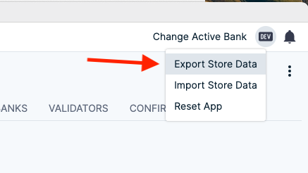
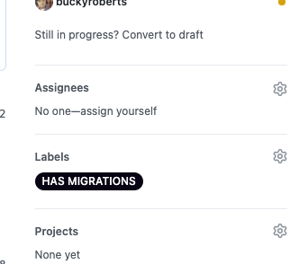

# Data Migrations in the Account Manager

Our app uses [Electron Store](https://github.com/sindresorhus/electron-store) to store persistent data.
Sometimes, changes are needed to update the old data structure.
Without proper migrations set in place, this will cause users' app to break,
forcing them to restart their app and lose all their precious data.

We have developed our own custom way to manage these migrations.

This will be a guide on how to review PRs with migrations, and on creating PRs with migrations.

## Table Of Contents

[Reviewing a PR with migrations](#reviewing)

[Submitting a PR with migrations](#creating)

## Reviewing a PR With Migrations

1. <b>Before checking out the branch with migrations</b>,
   export your current store data.
   This can be done by clicking the button on the top-right corner of your app:

<b>IMPORTANT</b>: This exported file contains sensitive information! Never share it to anyone!

2. Check out the branch with migrations.

3. Review the changes. You can even click the `export` again
   (to a different file from your first step's exported file)
   to compare how the `Electon Store`'s data has changed.

4. Once you are done reviewing the branch, checkout back to a branch without migrations.
   Then, once you have come out of the branch, click on the `Import Store Data` in the top-right,
   and import the data that you have exported in step #1.

5. Your old data (before the migrations) should now be restored.
   <b>IMPORTANT</b>: for security reasons, delete all the exported data from your computer
   (the exported data from step #1 and #3). These files contain sensitive information,
   and should never be kept around in your computer.

## Submitting a PR With Migrations

1. Before starting on data migrations, `export` your current data
   (same as step #1 above within the `Reviewing a PR`),
   such that you can always fallback to it in case you inadvertently effect the store data.
   Keep this file in a secure location until you get to step #6.

2. Write your migrations & tests, using the file:
   `renderer/store/local/migrationFiles/00000/index.ts` as a model.

   - Separate different types of data change as separate function.
     This will make it easier for PR reviewers to understand, and also to write unit tests.
   - Write unit tests on all the functions you have created.

3. After you are confident that the migration has been written correctly,
   push your migration function to the `migrationFunctions` array in:
   `renderer/store/local/migrations.ts`.

4. Restarting the app should run the migrations you have just added.
   If you ever need to revert,
   you can remove the migration you have added to the `migrationFunctions` array in step #3,
   and then`import` the data you have `exported` from step #1.
   (This is the same step as step #4 within the `Reviewing a PR`).

5. Once you are done with your branch, submit a PR.
   Make sure you write clearly that you have data migrations,
   and link the `Reviewing a PR With Migrations` section within the description.
   Add the `HAS MIGRATIONS` tag on your PR:

6. Once the PR has fully been reviewed and merged,
   delete the `exported` data from step #1 (and any other exported data you might have).
